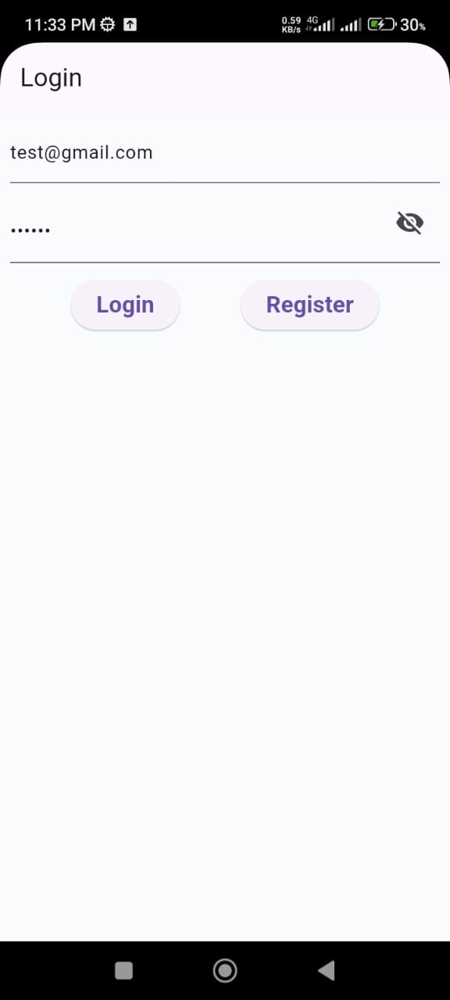
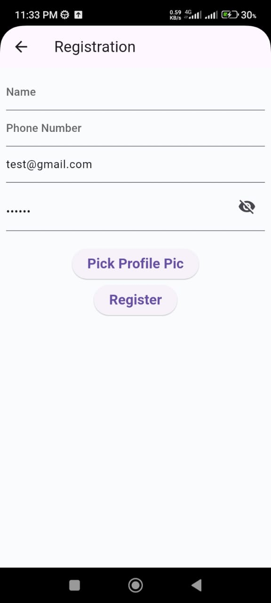
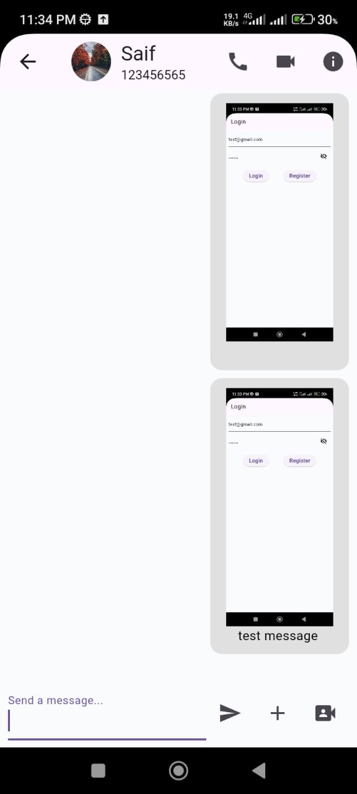
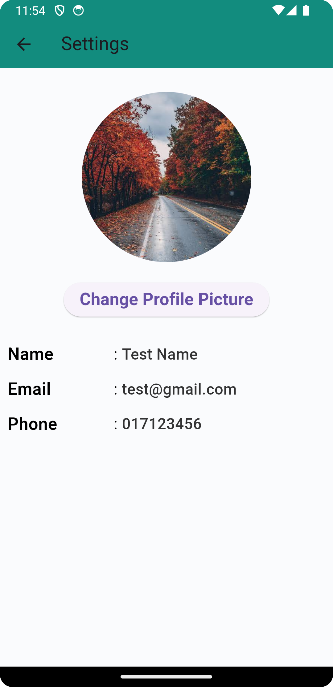

# Appifylab Senior Flutter Developer Hiring Test

## Overview

This Flutter project is part of the hiring process for Appifylab. The goal of the project is to recreate of WhatsApp with some extra features.
Anyone can message anyone if user is registered on the system
You can register and login to the system
You can see the list of chats
You can chat with the user


# How to run the project
simply clone the project and run "flutter pub get" in the terminal on the root project directory
then run the project from the terminal by running the command "flutter run  lib/main_dev.dart or flutter run  lib/main_prod.dart"

# Tested on Android only


## Project Structure

The project follows a modular structure, and key components are organized as follows:

```bash
├── app
│ ├── bindings
│ │ └── initial_binding.dart
│ ├── core
│ │ ├── base
│ │ │ ├── base_controller.dart
│ │ │ ├── base_remote_source.dart
│ │ │ ├── base_view.dart
│ │ │ ├── base_widget_mixin.dart
│ │ │ ├── mixins
│ │ │ │ ├── shorter_enum_mixin.dart
│ │ │ │ ├── table_mixin.dart
│ │ │ │ └── validator_mixin.dart
│ │ │ └── paging_controller.dart
│ │ ├── model
│ │ │ ├── page_state.dart
│ │ │ └── page_status.dart
│ │ ├── modules
│ │ │ └── module_create.sh
│ │ ├── utils
│ │ │ └── debouncer.dart
│ │ ├── values
│ │ │ ├── app_colors.dart
│ │ │ ├── app_values.dart
│ │ │ └── text_styles.dart
│ │ └── widget
│ │ ├── app_bar_title.dart
│ │ ├── asset_image_view.dart
│ │ ├── custom_app_bar.dart
│ │ ├── dialog_pattern.dart
│ │ ├── elevated_container.dart
│ │ ├── icon_text_widgets.dart
│ │ ├── label_value.dart
│ │ ├── loading.dart
│ │ ├── paging_view.dart
│ │ ├── ripple.dart
│ │ └── text_form_field_widget.dart
│ ├── data
│ │ ├── local
│ │ │ ├── db
│ │ │ └── preference
│ │ │ ├── preference_manager.dart
│ │ │ └── preference_manager_impl.dart
│ │ └── remote
│ ├── global_modals
│ │ ├── add_chat_modal
│ │ │ ├── add_chat_modal_binding.dart
│ │ │ ├── add_chat_modal_controller.dart
│ │ │ └── add_chat_modal_view.dart
│ │ └── empty
│ ├── model
│ │ ├── chat_message.dart
│ │ └── receiver_user.dart
│ ├── modules
│ │ ├── calls
│ │ │ ├── calls_bindings
│ │ │ │ └── calls_binding.dart
│ │ │ ├── calls_controllers
│ │ │ │ └── calls_controller.dart
│ │ │ └── calls_view
│ │ │ └── calls_view.dart
│ │ ├── camera
│ │ │ ├── bindings
│ │ │ │ └── camera_binding.dart
│ │ │ ├── controllers
│ │ │ │ └── camera_controller.dart
│ │ │ └── views
│ │ │ └── camera_view.dart
│ │ ├── chat_with_user
│ │ │ ├── bindings
│ │ │ │ └── chat_with_user_binding.dart
│ │ │ ├── controllers
│ │ │ │ └── chat_with_user_controller.dart
│ │ │ └── view
│ │ │ └── chat_with_user_view.dart
│ │ ├── chats
│ │ │ ├── bindings
│ │ │ │ └── chats_binding.dart
│ │ │ ├── controllers
│ │ │ │ └── chats_controller.dart
│ │ │ ├── views
│ │ │ │ └── chats_view.dart
│ │ │ └── widget
│ │ │ └── chat_card.dart
│ │ ├── communities
│ │ │ ├── communities_bindings
│ │ │ │ └── communities_binding.dart
│ │ │ ├── communities_controllers
│ │ │ │ └── communities_controller.dart
│ │ │ └── communities_view
│ │ │ └── communities_view.dart
│ │ ├── login
│ │ │ ├── bindings
│ │ │ │ └── login_binding.dart
│ │ │ ├── controllers
│ │ │ │ └── login_controller.dart
│ │ │ └── views
│ │ │ └── login_view.dart
│ │ ├── main
│ │ │ ├── bindings
│ │ │ │ └── main_binding.dart
│ │ │ ├── controllers
│ │ │ │ ├── bottom_nav_controller.dart
│ │ │ │ └── main_controller.dart
│ │ │ ├── model
│ │ │ │ ├── menu_code.dart
│ │ │ │ └── menu_item.dart
│ │ │ └── views
│ │ │ ├── bottom_nav_bar.dart
│ │ │ └── main_view.dart
│ │ ├── register
│ │ │ ├── bindings
│ │ │ │ └── register_binding.dart
│ │ │ ├── controllers
│ │ │ │ └── register_controller.dart
│ │ │ └── views
│ │ │ └── register_view.dart
│ │ ├── settings
│ │ │ ├── bindings
│ │ │ │ └── settings_binding.dart
│ │ │ ├── controllers
│ │ │ │ └── settings_controller.dart
│ │ │ └── views
│ │ │ └── settings_views.dart
│ │ ├── splash
│ │ │ ├── bindings
│ │ │ │ └── splash_binding.dart
│ │ │ ├── controllers
│ │ │ │ └── splash_controller.dart
│ │ │ └── views
│ │ │ └── splash_view.dart
│ │ └── updates
│ │ ├── bindings
│ │ │ └── update_binding.dart
│ │ ├── controllers
│ │ │ └── update_controller.dart
│ │ └── views
│ │ └── update_view.dart
│ ├── my_app.dart
│ ├── network
│ │ ├── dio_provider.dart
│ │ ├── dio_request_retrier.dart
│ │ ├── error_handlers.dart
│ │ ├── exceptions
│ │ │ ├── api_exception.dart
│ │ │ ├── app_exception.dart
│ │ │ ├── base_api_exception.dart
│ │ │ ├── base_exception.dart
│ │ │ ├── json_format_exception.dart
│ │ │ ├── network_exception.dart
│ │ │ ├── not_found_exception.dart
│ │ │ ├── service_unavailable_exception.dart
│ │ │ ├── timeout_exception.dart
│ │ │ └── unauthorize_exception.dart
│ │ ├── pretty_dio_logger.dart
│ │ └── request_headers.dart
│ └── routes
│ ├── app_pages.dart
│ └── app_routes.dart
├── firebase_options.dart
├── flavors
│ ├── build_config.dart
│ ├── env_config.dart
│ └── environment.dart
├── l10n
│ ├── app_bn.arb
│ └── app_en.arb
├── main_dev.dart
└── main_prod.dart
```

## State Management

This project uses **GetX** for state management. The relevant files are located in the `lib/app/core/base` directory:

- `base_controller.dart`: Controller for managing the state of the pages
- `base_remote_source.dart`: Remote source for fetching data from the API
- `base_view.dart`: Base view for the pages
- `base_widget_mixin.dart`: Mixin for common widgets
- `mixins`: Contains different mixins for the project
- `paging_controller.dart`: Controller for managing the state of the paging view
- `model`: Contains the page state and page status models
- `modules`: Contains the different modules of the project
- `utils`: Contains utility modules and helper functions used across the app
- `values`: Contains the app colors, values, and text styles
- `widget`: Contains commonly used widgets across the app
- `data`: Contains the local and remote data sources
- `global_modals`: Contains the global modals used in the app
- `model`: Contains the models used in the app
## Libraries Used

- **[get](https://pub.dev/packages/get)**: State management library for Flutter with a focus on simplicity and performance.
- **[nb_utils](https://pub.dev/packages/nb_utils)**: A package for common utility methods and widgets.

## Screenshots Android







